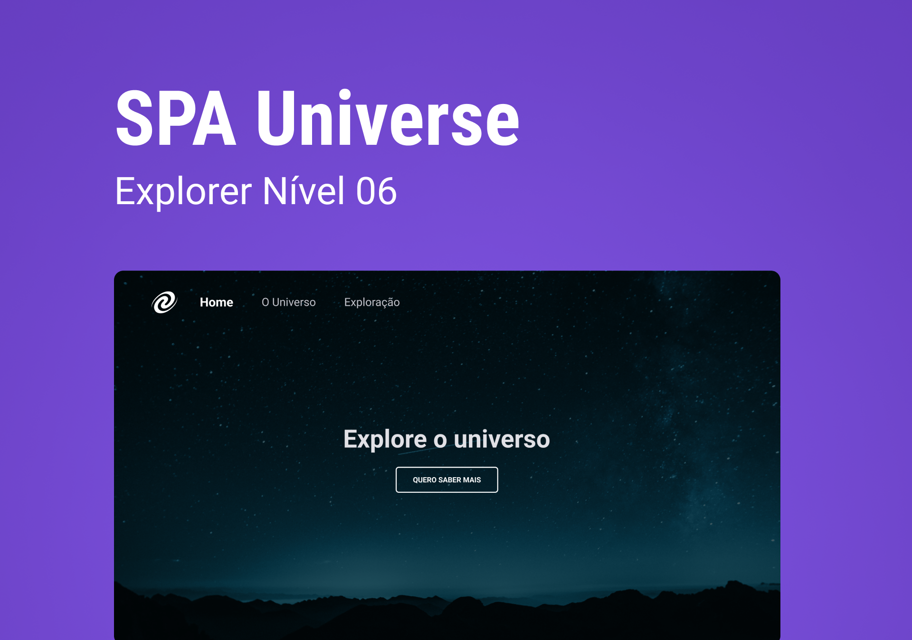

# SPA Universe

Uma aplicação criada para desenvolvimento das habilidade de programação durante o bootcamp Explorer da Rocketseat.

Ela consiste no desenvolvimento de um sistema de uma única pagina que será carregada e irá consumir apenas o conteúdo HTML das demais, agilizando o processo de criação e também otimizando o funcionamento do sistema.

Durante o desafio foram desenvolvidas conhecimentos como:

- Conceitos de SPA;
- Mapeamento de rotas;
- JavaScript assíncrono e promises;
- Orientação a objetos;
- Classes e muito mais.
